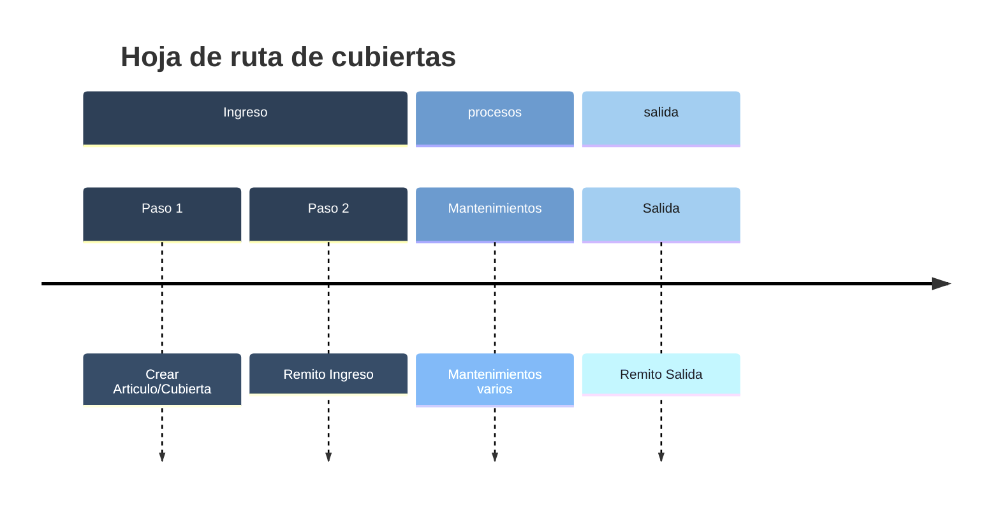

# Cubiertas

## Procesos de Mantenimientos

El recorrido de cada cubierta dentro del sistema se organiza en tres grandes momentos.
Cada uno cuenta con su propia documentación, donde se explican los procedimientos, registros y controles asociados:

### 🟢 Ingreso

La cubierta entra al sistema mediante la creación del artículo y luego la generación del remito de ingreso.

[👉 Ver creacion del articulo](./crearcuiertas.md)

[👉 Ver detalle del Ingreso](./remitoingresocubiertas.md)

### 🔵 Procesos

Aquí se registran los diferentes mantenimientos y movimientos (rotaciones, reparaciones, cambios, etc.).

[👉 Ver detalle del mantenimeinto](../../flows/Mantenimiento/DetalledeMantenimientodeCubiertas.md)

### 🟠 Salida

El ciclo finaliza con la emisión del remito de salida y la actualización del historial de la cubierta.

[👉 Ver detalle de la Salida](./remitosalidacubiertas.md)
