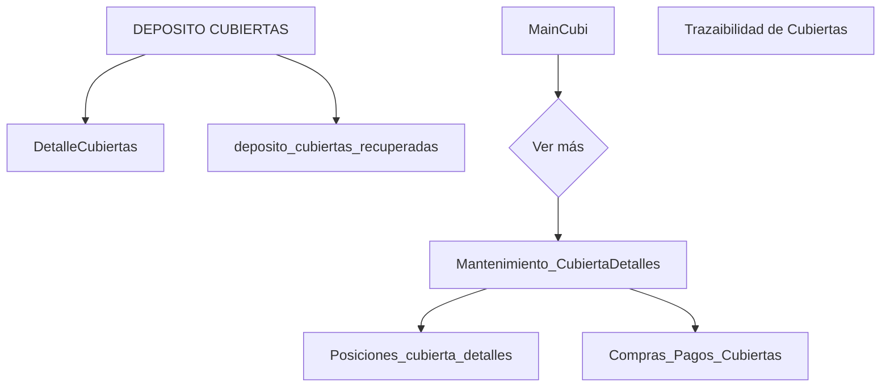

# Diagrama

```mermaid
flowchart TD
    A[DEPOSITO CUBIERTAS] --> B[DetalleCubiertas]
    A --> C[deposito_cubiertas_recuperadas]

    D[MainCubi] --> E{Ver más}
    E --> F[Mantenimiento_CubiertaDetalles]
    F --> G[Posiciones_cubierta_detalles]
    F --> H[Compras_Pagos_Cubiertas]

    I[Trazaibilidad de Cubiertas]

```
