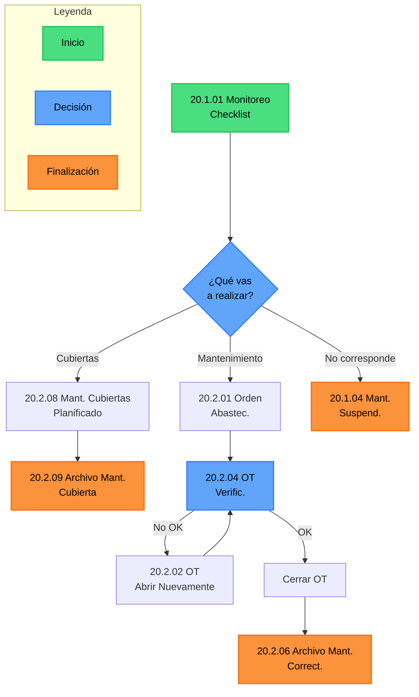

# Mantenimiento

El Flujo de Mantenimiento de Unidades y Cubiertas organiza todas las acciones desde la detección de una necesidad (checklist inicial) hasta el archivo final de la orden de trabajo.

## Su propósito es:

- Garantizar la trazabilidad de cada intervención, ya sea preventiva o correctiva.
- Definir responsabilidades: el Operario de Mantenimiento ejecuta el trabajo, mientras que el Auxiliar Administrativo gestiona la documentación y abastecimiento.
- Controlar calidad: mediante la verificación de OT, asegurando que las tareas (montajes, rotaciones, reparaciones de cubiertas, etc.) se cumplieron correctamente.
- Cerrar el ciclo con la imputación de costos y el archivo, manteniendo actualizado el historial de la unidad y de las cubiertas.

## Diagrama

## Resumen del Flujo de Mantenimiento

El proceso inicia siempre en el **Monitoreo – Checklist (20.1.01)**.  
Desde ahí se distinguen dos caminos principales:

### Mantenimiento preventivo

- Es registrado directamente por el **Operario de Mantenimiento (Cristian)**.
- Cuando corresponde, se continúa con el **Mantenimiento Planificado de cubiertas (20.2.08)**.
- Al finalizar, se archiva en **Archivo mantenimiento cubierta (20.2.09)**.

### Otros mantenimientos de unidad (cubiertas u otros)

- El **Operario** completa la planilla y la pasa al **Auxiliar Administrativo**.
- El Auxiliar gestiona la **Orden de Abastecimiento (20.2.01)**.
- Se realiza la **Verificación de la OT (20.2.04)**.
- Si el trabajo no es correcto, la **OT se abre nuevamente (20.2.02)**.
- Una vez cerrado correctamente, se archiva en **Archivo de mantenimiento correctivo (20.2.06)**.

### Casos especiales

- En casos donde la acción no corresponde, se registra como **Mantenimiento Suspendido (20.1.04)**.

Para más detalle ver:

- [20.1.01 Monitoreo – Checklist](./20.1.01_Monitoreo-Checklist.md)
- [20.2.03 Mantenimiento Cubiertas](./DetalledeMantenimientodeCubiertas.md)
- [20.2.01 Orden de Abastecimiento](./20.2.01-Orden-de-abastecimiento_Markdown.md)
- [20.2.04 OT Verificación](./OT_Verificacion.md)
- [20.2.02 OT Abierta nuevamente](./abrirNuevamente.md)
