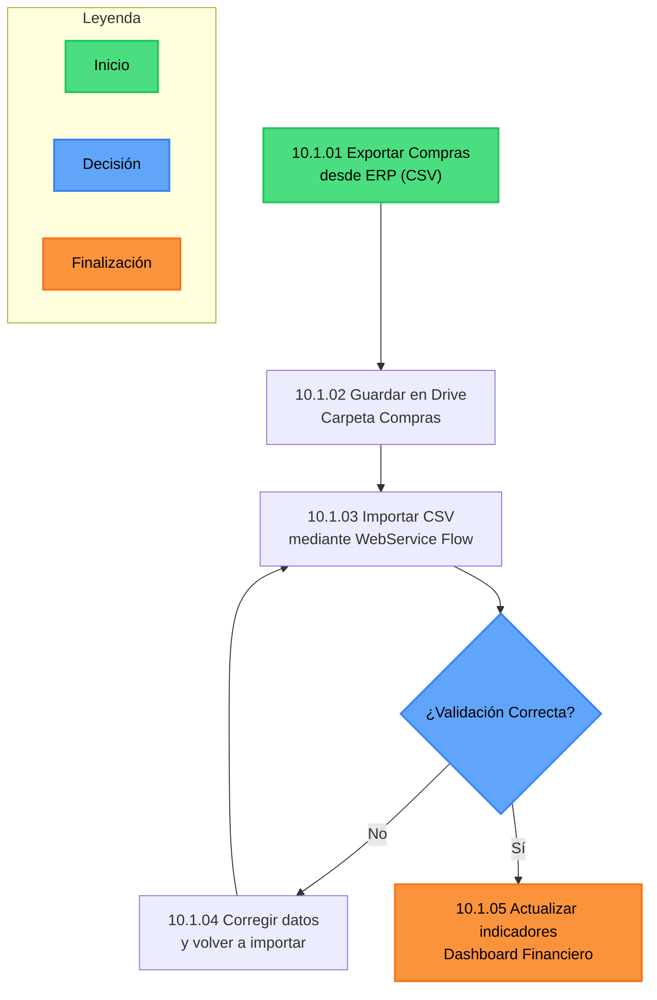

# Compras

El **Flujo de Compras** gestiona la integración entre el sistema **ERP** y **Flow**, garantizando que toda la información de facturas y gastos impacte correctamente en los indicadores del **Dashboard Financiero**.

## Su propósito es:

- Consolidar los datos de compras provenientes del ERP.
- Estandarizar el proceso de carga mediante archivos CSV centralizados en Drive.
- Automatizar la importación y validación en Flow a través de un WebService.
- Garantizar que los indicadores financieros reflejen información actualizada y trazable.

---

## Diagrama

# 10.1.03 Importar CSV – Flow

Este paso describe el procedimiento mediante el cual el sistema **Flow** importa los datos de compras provenientes del **ERP**, previamente exportados en formato CSV.  
El objetivo es integrar la información de compras al flujo de trabajo y actualizar los **indicadores del Dashboard Financiero**.

---

## Objetivo

- Automatizar la carga de movimientos de compras desde el ERP a Flow.
- Validar la estructura y contenido del archivo para evitar inconsistencias.
- Mantener los indicadores financieros actualizados en tiempo real.

---

## Requisitos previos

1. El archivo debe haberse generado desde el ERP conforme al procedimiento [10.1.01 Exportar Compras – ERP](./10-1-01-Exportar-Compras-erp.md).
2. El archivo CSV debe estar **guardado en la carpeta de Google Drive compartida**:
